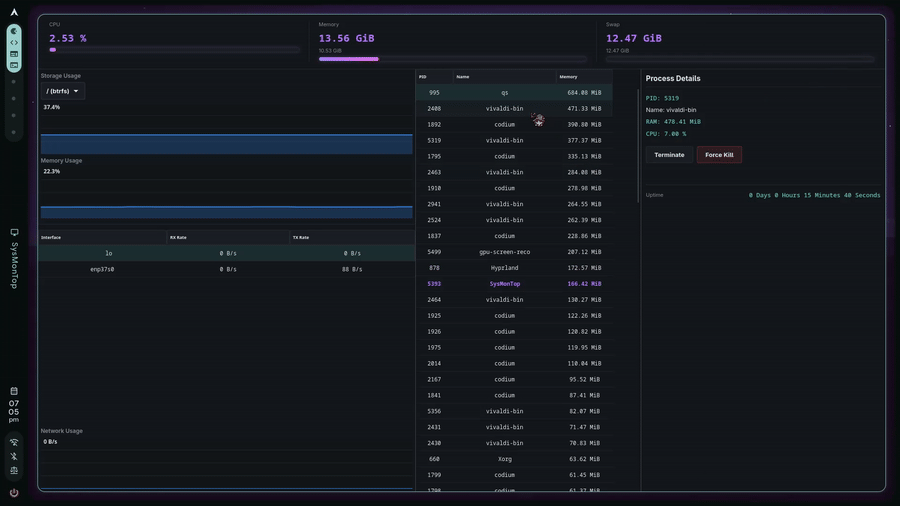

<p align="center">
  
</p>

<h1 align="center">SysMonTop</h1>





A lightweight GUI system monitor app built with C and GTK4 for linux.

---

## Features

- CPU Usage
- RAM Usage
- Swap Usage
- System Usage
- Process Usage
- Process Memory Sorting
- Storage Graph
- Network Graph
- Memory Graph
- Process Termination
- Specific Process tracking
- Auto Refresh


---

## Requirements

- GTK4
- Meson
- Ninja
- GCC or Clang

---

## Installation

### Step 1) Clone into the repository and cd

```bash
git clone https://github.com/Rujaeon0/SysMonTop.git
cd SysMonTop
```

### Build

```bash
meson setup build
meson compile -C build
```

### Run

```bash
./build/SysMonTop
```


### Future Updates pending...

- Temparature/sensors
- Better style and design

Made this project for myself to finish up my basics for C and do open source contribution...my codes may not be as good yet but if you installed this...thanks~


### Uses of AI...

- Generated a blp file and css styles and took help for GTK4 frontend using claude...the backends were fully made by me...used claude for frontend GTK4 because I am new to GTK4 plus GTK4 looked..."complicated".

## License

MIT License